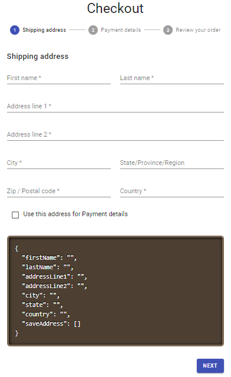

## Formik and Material UI goodies

Simple how to work Formik form with Material UI kit and use Yup as validation

## Screenshot

  

## Learn More

You can learn more in the [Formik forms](https://jaredpalmer.com/formik/).

To learn Material UI Kit, check out the [Material UI](https://material-ui.com/).

Validation Formik with [Yup](https://jaredpalmer.com/formik/docs/guides/validation)

Great Youtube stuff [React Form with Formik](https://www.youtube.com/watch?v=FD50LPJ6bjE).

## Author

✔ Eka Prasetia 🤵

✔ Collection my App

Find example all my [Scratch App](https://twolevel.net) 👉 on working 🛠

✔ Community

I am author for two communities in Indonesia

- GatsbyJS Indonesia [Gatsby-ID](https://gatsbyjs.id)
- RedwoodJS Indonesia [Redwood-ID](https://redwoodjs.id)
